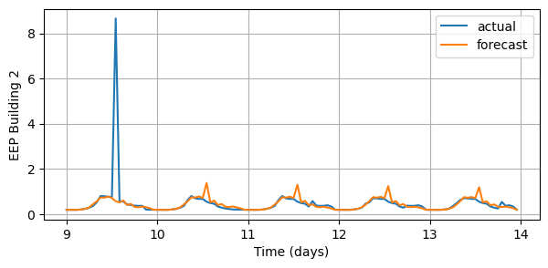
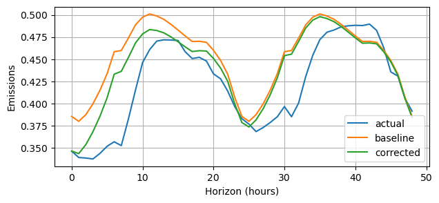

# [NeurIPS Citylearn Challenge 2023 - Forecasting Track](https://www.aicrowd.com/challenges/neurips-2023-citylearn-challenge/problems/forecasting-track-citylearn-challenge) 

This repository contains the 1st place solution for the NeurIPS 2023 Citylearn Challenge - Forecasting Track.

# Competition Overview
[The CityLearn Challenge 2023 - Forecasting Track](https://www.aicrowd.com/challenges/neurips-2023-citylearn-challenge/problems/forecasting-track-citylearn-challenge) focuses on designing models to predict the 48-hour-ahead end-use load profiles for each building in a synthetic single-family neighborhood, as well as the neighborhood-level 48-hour-ahead solar generation and carbon intensity profiles. The training data consists of hourly data from 3 buildings spanning a 1-month period. The models are evaluated on a different set of buildings and a different 3-month period. During evaluation, the 48-hour-ahead forecasts are rerun and evaluated every hour. The evaluation metric is RMSE.

# Solution Overview
The main challenges of this competition were:
* Working in the small data regime --- Participants only have 1 month of training data. Equivalently, this means 720 observations total, 30 observations for each hour of the day, and 4 observations for each hour of the week. Thus, if a model uses the hour of the week as an input, then special care needs to be taken to avoid overfitting.
* Handling the cold start problem --- The models were evaluated on new buildings with no opportunity to warm-start the model. Thus, the models needed to make reasonable predictions without any prior data.

Simple models are well-suited for addressing both of these challenges. In particular, the seasonal average and a few improvements to it worked particularly well on this dataset.

## Seasonal Average
The batch formula for calculating an average of $n$ data points is $\bar{x}_n = \frac{1}{n} \sum_{k=1}^n x_k$. However, this is computationally inefficient and requires us to keep track of the entire $n$ data points. The online formula for the average can be written as follows
$$
    \begin{align*}
    \bar{x}_n 
        = \underbrace{ \frac{n-1}{n} \cdot \bar{x}_{n-1} + \frac{1}{n} \cdot x_n}_{\text{convex combination}} 
        = \bar{x}_{n-1} + \frac{1}{n} \cdot \underbrace{ (x_n - \bar{x}_{n-1})}_{\text{update}}
    \end{align*}    
$$
Thus, to calculate the average of we only need to store the previous average $\bar{x}_{n-1}$ and the count $n$.  

The seasonal average simply keeps track of 24 averages, one for each hour of the day (or 168 averages, one for each hour of the week). 

## Improvements
There are a few simple improvements that can be made:
* better initialization
* filtering out large values (not clipping)        
* blending with the most recent observation

### Better Initialization
The sample average has high variance when $n$ is small. If we had some prior estimate $x_0$ for what the average should be, we could bias the average to be closer to the prior estimate using the following formula:
$$
\begin{align*}
\tilde{x}_n 
    &= \underbrace{\frac{n + \tau -1}{n + \tau} \cdot \tilde{x}_{n-1} + \frac{1}{n + \tau} \cdot x_n}_{\text{convex combination}}
    = \tilde{x}_{n-1} + \frac{1}{n + \tau} \cdot \underbrace{(x_n - \tilde{x}_{n-1})}_{\text{update}} \\
    &= \frac{n}{n + \tau} \cdot \bar{x}_{n} + \frac{\tau}{n + \tau} \cdot x_0
\end{align*}
$$
where $\tau$ is the weight on the prior. The last line shows that the biased sample average is convex combination of the regular sample average $\bar{x}$ and the prior estimate $x_0$. The weight on the prior is large when $\tau$ is large or $n$ is small. As $n$ increases, the biased sample average converges to $\bar{x}$. In this competition, prior estimates could be derived from the building metadata. 

### Filtering Out Large Values
The domestic hot water heating (DHW) load and the electrical equipment (EEP) load had large spikes that were difficult to predict. Including these values in the average calculation resulted in bad forecasts; filtering out the large values improved the forecasts. The following figures shows the effects of the large spikes on the forecasts. 

### Blending with the Most Recent Observation
Some of the load-types exhibited a high degree of autocorrelation. A simple way to improve the averages is to correct the level of the forecast using the following fomula
$$
\hat{x}_{n+h} = \bar{x}_{n+h} + \alpha^h (x_n - \bar{x}_{n})
$$
where $h$ is the horizon and $\alpha$ is the blending weight (roughly $0.93$). The following figure shows how this simple correction can improve the forecasts. 

